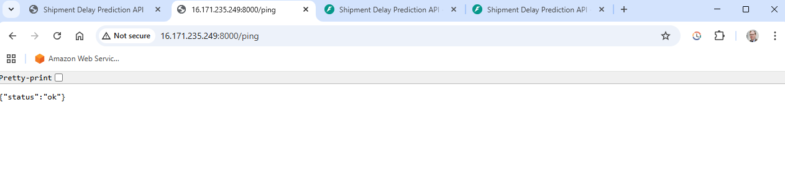

# Predicting Late Shipments: An End-to-End Machine Learning Project

## Project Overview

Timely delivery is a critical factor in supply chain management, as late shipments can lead to customer dissatisfaction, revenue loss, and increased operational costs. In this project, I use machine learning to develop predictive models for a global sports and outdoor equipment retailer to proactively identify high-risk shipments before delays occur.

The project follows modern best practices in data science and machine learning development:

- **Modular pipeline**: Cleanly separated stages for loading, cleaning, feature engineering, preprocessing, training, and evaluation.
- **MLflow integration**: Tracks experiments and hyperparameter tuning for reproducibility.
- **REST API deployment**: Trained models are served using **FastAPI**, packaged in a **Docker** container, stored in **Amazon ECR**, and deployed on **Amazon ECS Fargate** with artifacts loaded from **Amazon S3**.
- **Automated testing**: FastAPI routes are verified using **pytest**, including landing page, health check, and prediction endpoints.
- **Structured logging**: Unified logging system records progress and errors for easier debugging and traceability.
- **Exploratory data analysis (EDA)**: Initial insights and feature selection decisions are documented in a dedicated Jupyter notebook.

**Tech Stack Overview:**

- **Core Python & ML**: `Python 3.11`, `pandas`, `NumPy`, `scikit-learn`, `joblib`, `RobustScaler`, `OneHotEncoder`, `OrdinalEncoder`  
- **API & Deployment**: `FastAPI`, `Pydantic`, `Uvicorn`, `Docker`, `pytest`  
- **Experiment Tracking**: `MLflow`  
- **Infrastructure (AWS)**: `Amazon ECS (Fargate)`, `Amazon ECR`, `Amazon S3`, `AWS IAM`, `Amazon CloudWatch`  
- **Utilities**: `logging`, `pathlib`, `datetime`  

Together, these tools support a modular, reproducible, and production-ready ML workflow.

## Dataset Information

The data for this project is provided by DataCo and is publicly available on Kaggle ([link](https://www.kaggle.com/datasets/shashwatwork/dataco-smart-supply-chain-for-big-data-analysis)). It contains approximately 180,000 transactions that are shipped to 164 unique countries over the span of three years. The dataset provides a comprehensive view of supply chain operations, including:
- **Order details:** Order IDs, order destination, and order dates.
- **Product information:** Product IDs, pricing, and sales.
- **Customer data:** Customer segment and locations.
- **Shipping records:** Scheduled vs. actual delivery times, shipping mode, and delivery status.

## Business Problem

The dataset reveals that 57% of completed shipments are late by at least one day, and more than 7% are delayed by three or more days. To improve on-time delivery rates, businesses need to identify high-risk shipments early and take proactive measures to mitigate delays.

## Solution Approach

To address the challenge of shipment delays, this project builds machine learning models that classify whether a shipment will arrive late or very late. These predictive tools help prioritize shipments that require early intervention or adjusted logistics handling.

Two Random Forest classifiers were trained:
1. **Late Order Model (optimized for accuracy)**  
   Predicts whether an order will be delivered late (by at least one day).

2. **Very Late Order Model (optimized for recall)**  
   Predicts whether an order will be three or more days late prioritizing recall to flag high-risk shipments early in the process.

## Model Performance

Two Random Forest models were developed and evaluated on a hold-out test set (25% of the dataset), with each optimized for a metric aligned to its business use case.

- **Late Shipment Model (optimized for accuracy):**
  - **Test Accuracy:** 86.14%

- **Very Late Shipment Model (optimized for recall):**
  - **Test Recall:** 97.58%
  - **Average Precision Score:** 95.49% (Threshold: 0.3)

The late model provides broad classification coverage of delayed shipments, while the very late model prioritizes capturing as many high-risk cases as possible. Together, they support more proactive and targeted logistics interventions.

## Project Architecture

The repository follows a modular, production-ready structure designed for clarity, reproducibility, and scalability. Key components include data preprocessing scripts, model training modules, a containerized FastAPI application, and automated tests. Below is an overview of the file and folder organization:

```text
late-shipment-predictions-ml/
│
├── api/                     # FastAPI application and endpoint logic
│   ├── main.py
│   └── shipment_schema.py
│
├── assets/                 # Proof artifacts (screenshots) showing live deployment
│   ├── cloudwatch_startup.png
│   ├── swagger_docs.png
│   ├── swagger_landing.png
│   ├── swagger_ping.png
│   ├── swagger_predict_late.png
│   └── swagger_predict_very_late.png
│
├── data/                            # Data storage directory
│   ├── raw/                         # Contains raw shipment data (included)
│   │   └── shipments_raw.csv        # Main dataset used as pipeline input
│   ├── unprocessed/                 # Generated intermediate data after cleaning
│   │   └── X_unprocessed.pkl        # Data snapshot before encoding and scaling
│   ├── preprocessed/                # Final features used for model training
│   │   ├── X_train.pkl
│   │   ├── X_test.pkl
│   │   ├── y_late_train.pkl
│   │   ├── y_late_test.pkl
│   │   ├── y_very_late_train.pkl
│   │   └── y_very_late_test.pkl
│   └── docs/                        # Supporting documentation
│       └── variable_description.csv # Column descriptions and definitions
│
├── infra/                  # Infrastructure blueprints for AWS ECS/Fargate deployment
│   ├── iam_policy.json        # IAM policy allowing the ECS task role to list and read objects from the S3 bucket `late-shipments-artifacts-bengt`
│   └── task_def.json          # ECS Task Definition (family: late-shipment-api) specifying container image, roles, ports (8000), logging, CPU/memory, and Fargate runtime platform
│
├── logs/
│   └── pipeline.log         # Logs from local pipeline runs (production logs handled by CloudWatch)
│
├── mlruns/                  # MLflow experiment tracking (created during tuning, not included by default)
│
├── models/                  # Trained ML models and preprocessing artifacts
│   ├── late_model.pkl          # Random Forest model predicting late shipments (1+ days)
│   ├── very_late_model.pkl     # Random Forest model predicting very late shipments (3+ days)
│   ├── onehot_encoder.pkl      # Encoder for nominal categorical features
│   ├── ordinal_encoder.pkl     # Encoder for ordinal categorical features
│   └── scaler.pkl              # Scaler for numeric feature normalization
│
├── notebooks/               # Exploratory Data Analysis (EDA)
│   └── eda.ipynb                # Initial data exploration, feature trends, and target imbalance visualization
│
├── routers/                 # FastAPI route definitions
│   ├── landing.py              # Defines the root ("/") endpoint with a landing page message
│   ├── ping.py                 # Health check endpoint ("/ping") for uptime monitoring
│   ├── predict_late.py         # Endpoint for predicting late shipments (1+ day delay)
│   └── predict_very_late.py    # Endpoint for predicting very late shipments (3+ day delay)
│
├── src/                     # Core logic for the machine learning pipeline
│   ├── load_data.py              # Loads raw shipment data from CSV into a DataFrame
│   ├── clean_data.py             # Cleans missing values, handles duplicates, and filters irrelevant rows
│   ├── feature_engineering.py    # Generates predictive features (e.g., shipping duration, delivery gaps)
│   ├── preprocess_features.py    # Splits data, encodes categorical variables, scales features, and saves transformers
│   ├── train_late_model.py       # Trains Random Forest classifier to predict late shipments (optimized for accuracy)
│   ├── train_very_late_model.py  # Trains separate Random Forest classifier for very late shipments (optimized for recall)
│   └── logger.py                 # Centralized logger for consistent logging across all modules
│
├── tests/                    # Pytest scripts for testing API endpoints
│   ├── test_main.py               # Tests root landing page and /ping health check endpoint
│   ├── test_predict_late.py       # Tests /predict_late route (1+ day delay)
│   └── test_predict_very_late.py  # Tests /predict_very_late route (3+ day delay)
│
├── tuning/                  # Model tuning scripts with MLflow experiment tracking
│   ├── tune_late_model.py       # Tunes Random Forest for predicting 1+ day late shipments (optimized for accuracy)
│   └── tune_very_late_model.py  # Tunes Random Forest for 3+ day late shipments (optimized for recall)
│
├── run_pipeline.py          # Main pipeline script to execute the ML workflow
├── requirements.txt         # List of dependencies
├── Dockerfile               # Used to containerize and deploy the FastAPI app
└── README.md
```

## Installation and Running the Pipeline

This project includes a complete **machine learning pipeline** for predicting shipment delays. The pipeline prepares the data and trains two models: one for **"late"** deliveries and one for **"very late"** deliveries.

Key pipeline features:
- Fully automated script: `run_pipeline.py`
- Cleans and transforms raw shipment data
- Trains two separate classification models
- Saves preprocessing tools and model files to the `models/` directory
- Console logging for easy progress tracking

**To get started:**
1. Make sure Python 3.11+ is installed on your system.
2. (Optional but recommended) Create and activate a virtual environment.
3. Install dependencies by running:
   ```bash
   pip install -r requirements.txt
   ```
4. Execute the pipeline script:
   ```bash
   python run_pipeline.py
   ```

**Note:**
Running the pipeline will generate two model files:
- models/very_late_model.pkl
- models/late_model.pkl

These models are used by the FastAPI app for inference via the /predict_very_late and /predict_late endpoints.

## Deployment

This project includes a deployable **REST API** built with **FastAPI**, allowing users to interact with a trained machine learning model via HTTP requests.

### Key deployment features
- **Containerized with Docker** and stored in **Amazon ECR**
- Deployed on **Amazon ECS Fargate** (serverless container service) within a managed cluster
- **Models and preprocessing artifacts** are loaded securely from **Amazon S3**
- **FastAPI** application serves prediction endpoints for both the **"late"** (≥1 day) and **"very late"** (≥3 days) shipment models
- **Interactive API documentation** available via **Swagger UI** at `/docs`
- **Schema validation** is implemented using Pydantic models to ensure input correctness
- A **/ping** route is included for uptime and health monitoring
- **Logs** from the service are streamed to **Amazon CloudWatch** for observability

### Cloud Architecture (high level)

The client (Swagger/Postman) calls a FastAPI container on ECS Fargate.  
At startup the app loads **preprocessing artifacts and models** from Amazon S3.  
Runtime logs go to CloudWatch.

```mermaid
flowchart LR
  Client[Client (Swagger/Postman)] -->|HTTP| ECS[Fargate Service (FastAPI)]
  ECS -->|Load preprocessing + models| S3[(Amazon S3)]
  ECS -->|Logs| CW[CloudWatch Logs]
```

### Deployment Steps (AWS ECS Fargate)

To reproduce this deployment yourself:

1. **Build and tag the Docker image**

   ```powershell
   $ACCOUNT_ID = "<your_aws_account_id>"
   $REGION     = "<aws_region>"   # e.g., eu-north-1
   $REPO       = "<your_repo_name>"   # e.g., late-shipment-api
   $REPO_URI   = "$ACCOUNT_ID.dkr.ecr.$REGION.amazonaws.com/$REPO"
   $TAG        = (Get-Date -Format "yyyy-MM-dd-HHmm")

   docker build -t "${REPO}:${TAG}" .
   docker tag "${REPO}:${TAG}" "${REPO_URI}:${TAG}"
   docker push "${REPO_URI}:${TAG}"
 ```

2. **Update ECS service**
- Go to the ECS console → select your service → Update
- Paste the new image URI, for example:
  <account_id>.dkr.ecr.<region>.amazonaws.com/<repo_name>:<tag>
- Check Force new deployment and confirm.

3. **Verify logs in CloudWatch**
- Look for startup logs showing that the scaler, encoders, and models are loaded from S3.

4. **Test the API**
- Open `http://<public_ip>:8000/docs` in a browser.
- Try `/ping` (should return `200`).
- Try `/predict_late/` with the sample JSON provided below.

### Proof of Deployment

Below are screenshots confirming the service is deployed, responding to requests, and serving predictions.

- **Startup logs in CloudWatch** showing that all artifacts (scaler, encoders, models) were loaded from S3  
  

- **Landing page** served by FastAPI  
  

- **Ping endpoint** responding successfully (`{"status":"ok"}`)  
  

- **Interactive API docs** available via Swagger UI  
  

- **Prediction endpoint** returning a valid response (`late_prediction: 1`)  
  

- **Very Late prediction endpoint** returning a valid response (`very_late_prediction: 0/1`)  
  


## Using the Deployed API

**Note:** The live service is currently paused (scaled to 0 on AWS ECS Fargate) to avoid unnecessary costs.  
You can still reproduce the deployment by following the steps in this repository.  
A stable public endpoint will be provided in **January 2026**.

To try out the deployed FastAPI app on AWS:

1. Open the Swagger UI in your browser at the service’s public IP:
   `http://<PUBLIC_IP>:8000/docs`

2. Locate either the `/predict_late/` or `/predict_very_late/` endpoint.

3. Click **"Try it out"**.

4. Paste the following sample JSON into the request body field:

```json
{
  "order_item_quantity": 4,
  "order_item_total": 181.92,
  "product_price": 49.97,
  "year": 2015,
  "month": 4,
  "day": 21,
  "order_value": 737.65,
  "unique_items_per_order": 4,
  "order_item_discount_rate": 0.09,
  "units_per_order": 11,
  "order_profit_per_order": 89.13,
  "type": "DEBIT",
  "customer_segment": "Home Office",
  "shipping_mode": "Standard Class",
  "category_id": 46,
  "customer_country": "EE. UU.",
  "customer_state": "MA",
  "department_id": 7,
  "order_city": "San Pablo de las Salinas",
  "order_country": "México",
  "order_region": "Central America",
  "order_state": "México"
}
```

5. Click **"Execute"**.

6. Scroll down to the **Response Body** to view the model prediction:
   - For /predict_late/ → 0 = Not late (less than 1 day), 1 = Late (1 or more days)
   - For /predict_very_late/ → 0 = Not very late (less than 3 days), 1 = Very late (3 or more days)

Note: Both endpoints use Random Forest classifiers. The late model is optimized for accuracy, while the very late model is optimized for recall to flag high-risk shipments.

## Testing the API Locally

Automated integration tests are included to verify key API functionality using `pytest`:

- `/` landing page returns the expected welcome message
- `/ping` health check responds successfully
- `/predict_late/` and `/predict_very_late/` endpoints return valid predictions

To run the tests locally:

```bash
pip install -r requirements.txt
python run_pipeline.py   # regenerate model files
pytest
```

All tests are located in the tests/ folder.